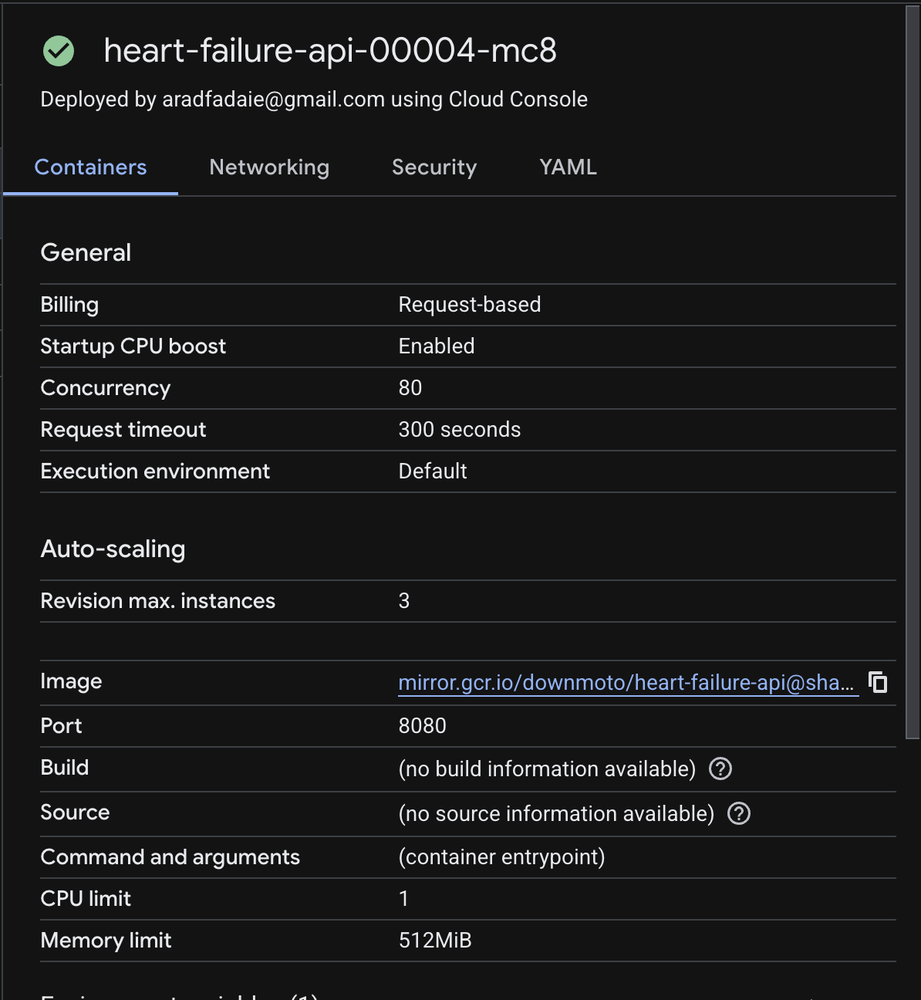
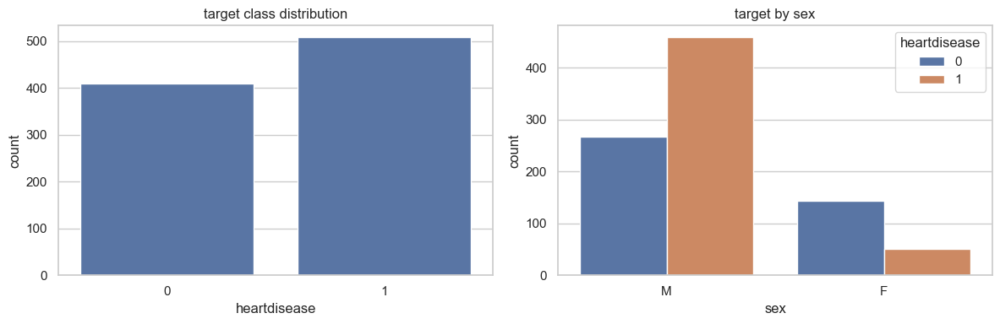
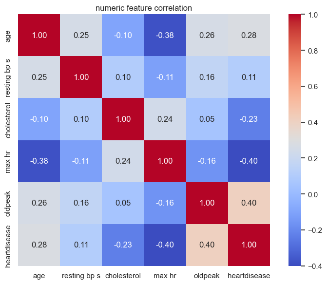
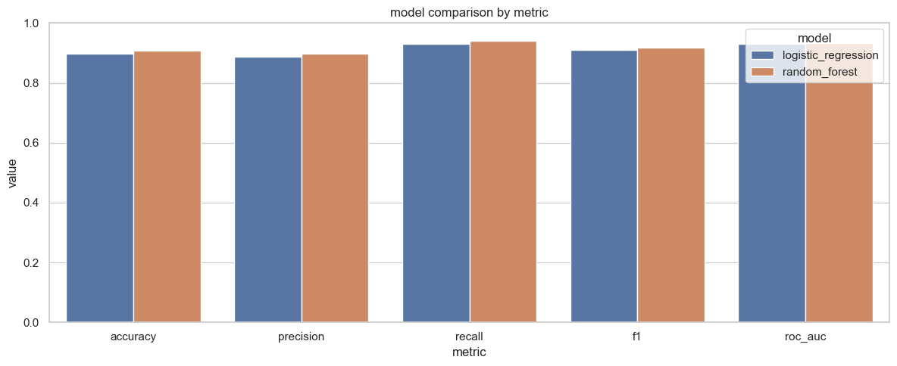
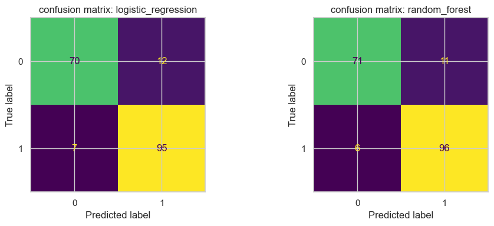
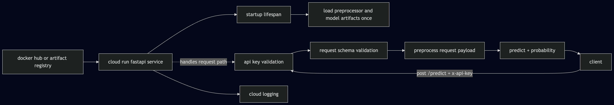
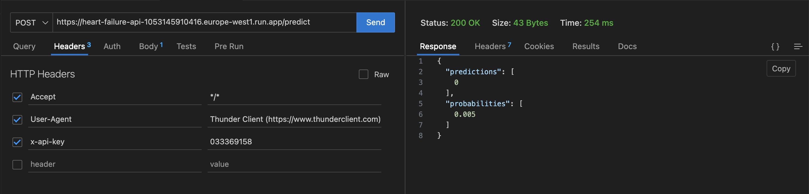
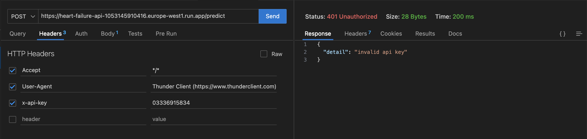
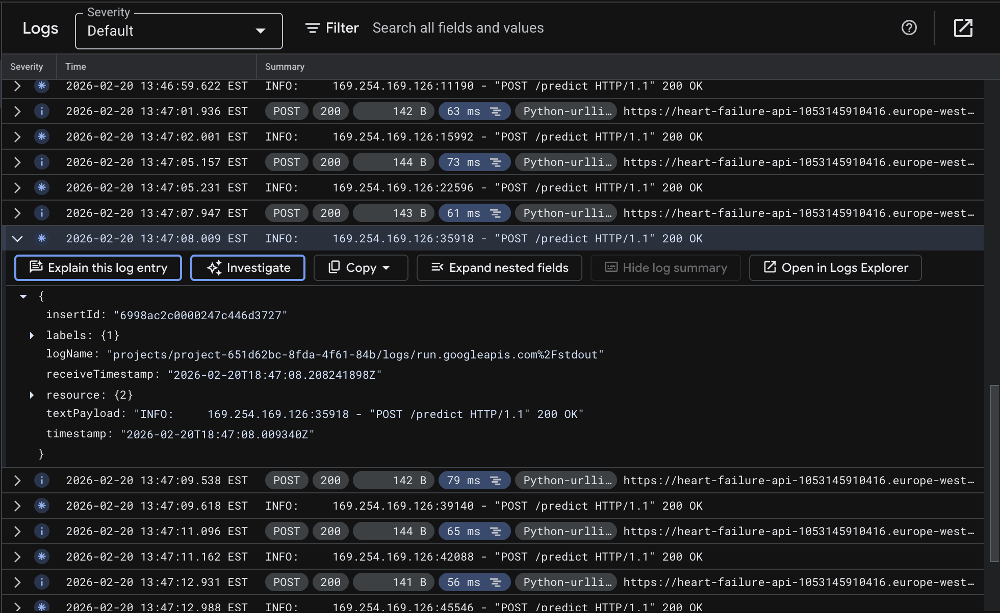

= Heart Failure Prediction API Deployment Report: Exploratory Analysis, Model Comparison, and Cloud Deployment with a Secure REST API
:author: Arad Fadaei
:doctype: book
:sectnums:
:toc: left
:toclevels: 3

== Executive Summary

This project implements a complete machine learning deployment workflow for heart disease risk prediction using the Kaggle Heart Failure Prediction dataset. The final output is a containerized FastAPI service deployed on Google Cloud Run, with API key authentication and real-time inference.

The system follows a train-once, infer-many design: model training occurs offline, while the deployed service only loads saved artifacts and performs prediction. This satisfies the assignment constraint against training during inference requests.

Two models were trained and compared:

- Logistic Regression
- Random Forest Classifier

Random Forest was selected based on F1 score and overall balanced performance.

// screenshot placeholder: final cloud run service overview page

== Machine Learning Problem and Dataset

=== Machine Learning Problem

The task is binary classification: predict whether a patient is likely to have heart disease from structured clinical and demographic features.

Target variable:

- `HeartDisease` where `0` means no heart disease predicted and `1` means heart disease predicted.

=== Dataset Used

- Dataset source: Kaggle (`fedesoriano/heart-failure-prediction`)
- Local file used for training: `data/heart.csv`
- Data loading helper: `scripts/download_dataset.py`

=== Feature Set

The model uses these inputs:

- age
- sex
- chest pain type
- resting blood pressure
- cholesterol
- fasting blood sugar flag
- resting ECG
- max heart rate
- exercise angina
- oldpeak
- ST slope

== Model Development Process

=== Exploratory Data Analysis (EDA)

EDA was performed in `EDA.ipynb` to understand distribution, class balance, and relationships between variables.

EDA outputs include:

- target class distribution
- target split by sex
- numeric feature distributions by target
- boxplots by target
- correlation heatmap
- grouped risk rates by key categories

// screenshot placeholder: target distribution figure

// screenshot placeholder: correlation heatmap

=== Preprocessing

Preprocessing is implemented with `ColumnTransformer` in `training/train.py`:

- numeric features: median imputation + standard scaling
- categorical features: mode imputation + one-hot encoding (`handle_unknown="ignore"`)

This ensures the same transformations are used during training and inference, reducing train/serve skew.

=== Training and Evaluation

Two models were trained on the same stratified split (`test_size=0.2`, `random_state=42`):

- Logistic Regression (`class_weight="balanced"`)
- Random Forest (`n_estimators=400`)

Evaluation metrics used:

- Accuracy
- Precision
- Recall
- F1 Score
- ROC AUC

Evaluation summary:

[cols="1,1,1,1,1,1",options="header"]
|===
|Model |Accuracy |Precision |Recall |F1 |ROC AUC
|Logistic Regression |0.8967 |0.8879 |0.9314 |0.9091 |0.9296
|Random Forest |0.9076 |0.8972 |0.9412 |0.9187 |0.9316
|===

Selected model: Random Forest (highest F1).

// screenshot placeholder: model comparison figure from notebook

// screenshot placeholder: confusion matrix and roc comparison

== Deployment Architecture Diagram and Cloud Services Used

=== Deployment Architecture Diagram

Architecture summary:

. Client sends `POST /predict` with JSON payload and `x-api-key`
. Cloud Run hosts the FastAPI container
. API key is validated
. Preprocessor and model artifacts are loaded and applied
. Prediction and probability are returned
. Logs are captured in Cloud Logging

// screenshot placeholder: architecture diagram image exported for report

=== Cloud Services Used

- Google Cloud Run: serverless container hosting for API
- Docker Hub image source: container image storage
- Cloud Logging: request and runtime logs

=== Containerization and API

Containerization is implemented with Docker:

- Base image: `python:3.12-slim`
- App server: `uvicorn src.main:app --host 0.0.0.0 --port 8080`
- Runtime secret: `API_KEY` environment variable
- Endpoint behavior:
* `GET /health` for service checks
* `POST /predict` for authenticated inference

== Challenges Faced and How They Were Overcome

=== Challenge 1: train/serve schema mismatch

Issue: source dataset columns and API request keys can differ.

Resolution: standardized column names in training and used explicit Pydantic aliases in API schemas.

=== Challenge 2: unseen categorical values at inference

Issue: new categorical values can break one-hot encoding.

Resolution: set `OneHotEncoder(handle_unknown="ignore")` in preprocessing pipeline.

=== Challenge 3: secure API key handling

Issue: keys should not be hardcoded in source or Dockerfile.

Resolution: read `API_KEY` from runtime environment variables and keep only `.env.example` as template.

=== Challenge 4: container architecture compatibility

Issue: Cloud Run deployment failed when image did not include `linux/amd64`.

Resolution: build and push amd64 image with `docker buildx --platform linux/amd64`.

== Conclusion and Future Improvements

This project successfully delivers a complete ML deployment pipeline, from EDA and model comparison to a live cloud-hosted API with authentication. The final implementation meets the assignment requirements and demonstrates an end-to-end operationalized workflow.

Potential future improvements:

- integrate Secret Manager for stronger secret governance
- add CI/CD for automated build, test, and deployment
- implement monitoring for drift and performance changes
- introduce model versioning and rollback strategy

== Screenshot Evidence of Working Deployment

. Successful `POST /predict` response from deployed endpoint
. Unauthorized `POST /predict` response (`401`) from deployed endpoint
. Cloud logs showing request handling

// screenshot placeholder: deployed predict success

// screenshot placeholder: deployed predict unauthorized

// screenshot placeholder: cloud logging request trace
